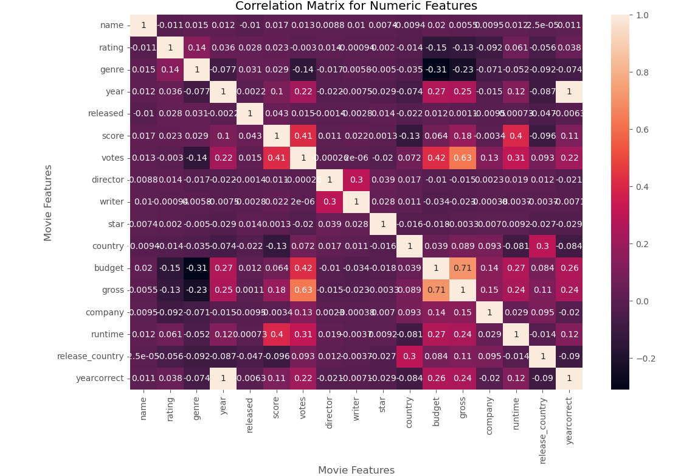

# 🎬 Movie Data Correlation Analysis with Python

## 📌 Project Overview
This project analyzes a dataset of movies to explore how various features (like budget, runtime, rating, and votes) correlate with gross revenue. The goal is to understand which factors most influence box office performance using real-world data.

## 🔧 Tools & Libraries
- Python
- Pandas
- Seaborn
- Matplotlib
- NumPy
- Jupyter Notebook

## 💡 Key Skills Demonstrated
- Data cleaning and wrangling
- Exploratory Data Analysis (EDA)
- Heatmaps and correlation matrix
- Statistical visualization
- Identifying relationships in data

## 📂 Project Structure
```
📓 Movie_Correlation_Project.ipynb       - Main code notebook
📄 README.md                             - Project documentation
📄 requirements.txt                      - Python packages used
📄 .gitignore                            - Files ignored in version control
📁 images                                - Plots or visual output
```

## 📸 Sample Output


## 🚀 How to Run
1. Clone this repository
2. Install dependencies:
   ```
   pip install -r requirements.txt
   ```
3. Run the notebook in Jupyter:
   ```
   jupyter notebook Movie_Correlation_Project.ipynb 
   ```

## 🔍 Insights Gained
- Votes and budget are highly correlated with gross revenue
- Genre and year can have weaker but interesting trends
- Cleaning and preprocessing are essential before analysis

## 🧠 What I Learned
- Identifying correlation doesn’t imply causation
- How to build visual insights from raw CSV files
- Using Seaborn’s heatmap and matplotlib for insight-driven analysis

## 🔮 Future Enhancements
- Use linear regression to model predictions
- Add feature engineering like genre grouping
- Build a Streamlit dashboard for interactive exploration

## 🧑‍💼 Author
**Shubham Bamane**  
Aspiring Data Analyst | MS in Data Science  
